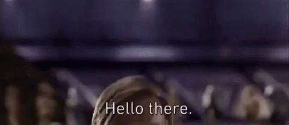

<!--Intro-->
<h1 align = "center">🐱‍👤 Welcome to my profile 🐱‍👤</h1>
<br/>
<div align = "center">
	
</div>
<br/>
<!--About-->
<h2 align = "center">(☞ﾟヮﾟ)☞ About me: ☜(ﾟヮﾟ☜)</h2>

<div align= "left">
<pre>			
```python
#!/usr/bin/python
# -*- coding: utf-8 -*-

class GameDeveloper:
	def __init__(self):
		self.name = "Felipe Batista"
		self.role = "Game Development student"
		self.language_spoken = ["pt_BR", "en_US"]
		self.tools = ["flutter", ".NET", "godot", "unity"]
		self.programming_languages = ["C#", "java", "python", "dart"]
		self.hobbies = ["games", "anime", "manga", "tech stuff", "drawing", "music"]
		self.learning = ["data strucutures"]

	def say_hello(self):
		print("Thanks for dropping by, i hope you like some of my projects.")

me = GameDeveloper()
me.say_hello()

</pre>
'''
</div>
<!--Stats-->
<a href="https://github.com/OrangePixelEye?tab=repositories">
	
</a>
<a href="https://github.com/OrangePixelEye?tab=repositories">
	
</a>
<br><br>

<div align = "center">
<!--Some projects-->
<h2 align = "center">(⌐■_■) Cool Projects: (⌐■_■)</h2>
<br/>
<a href="https://github.com/OrangePixelEye/FatecAmericanaCollection">
	
</a>
<br/>
<a href="https://github.com/OrangePixelEye/flutter-apps">
	
</a>
<br/>
<a href="https://github.com/OrangePixelEye/kitchen-invaders">
	
</a>
<br/>
</div>
<!--Contacts-->
<div align="center">
<h2 align = "center">ᓚᘏᗢContacts me:ᓚᘏᗢ</h2>
</div>
[](mailto:felipe.batistaa52@gmail.com)
[](https://www.linkedin.com/in/felipe-alves-batista-225464177/)
[](https://www.reddit.com/user/OrangePixelEye)
[](https://github.com/OrangePixelEye)

